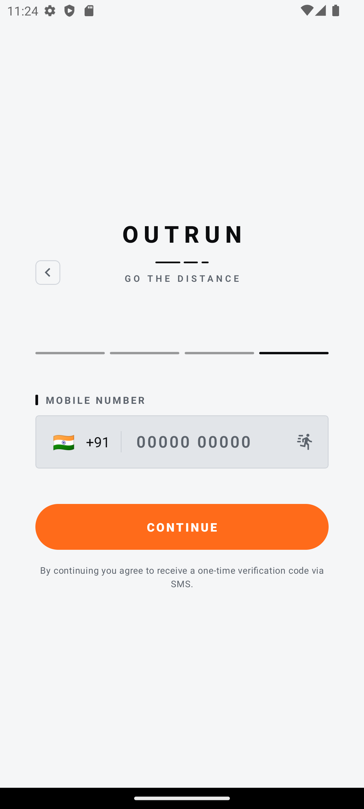
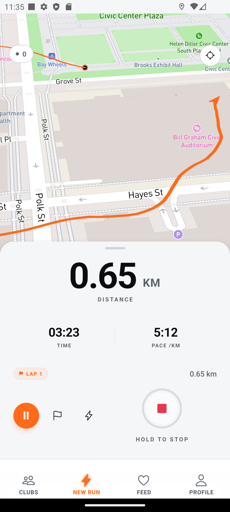
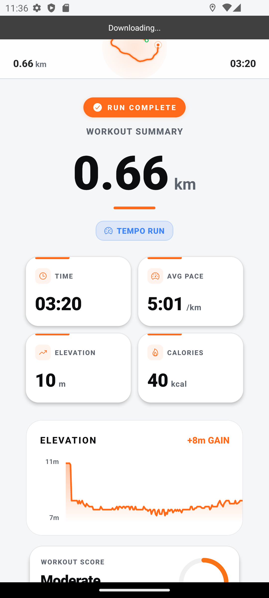
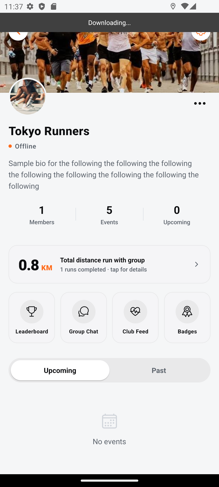
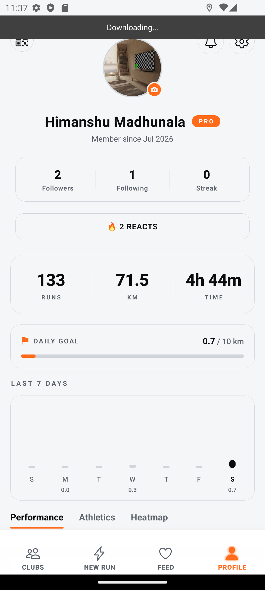
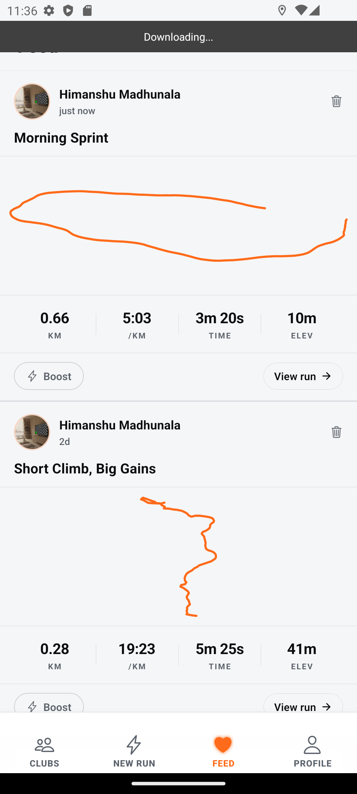
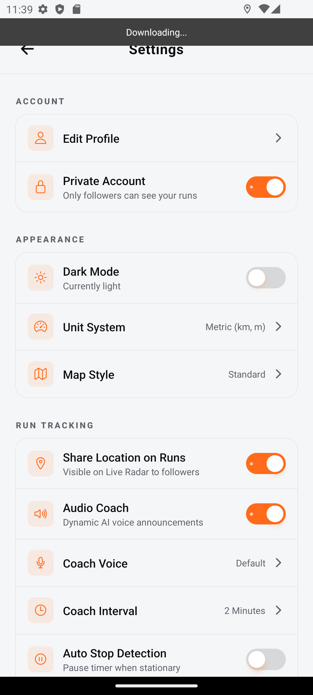

<div align="center">
  <h1>O U T R U N</h1>
  <p><strong>A sleek, high-performance, open-source social run tracker.</strong></p>
  <p>
    <a href="https://github.com/himanshu2005-tech/Outrun/releases/download/v1.0.0/app-release.apk">
      
    </a>
  </p>
</div>

---

Outrun is a next-generation running application built for athletes who want more than just a basic map. With a sleek dark-mode-first aesthetic, real-time global radar, ghost runner pacing, and powerful club analytics, Outrun is built to push your limits.

## 🔥 Key Features

- **Global & Club Radar**: See other runners live on the map while you run.
- **Ghost Runner Pacing**: Race against your previous best times dynamically on the map.
- **Dynamic "OUTRUN" Typography Timer**: A buttery-smooth custom UI countdown timer.
- **Pitch-Black Dark Mode**: True OLED dark mode with Flame Tangerine accents.
- **Advanced GPS Filtering**: Custom filtering algorithms for highly accurate distance and pace tracking.
- **Social Feed & Cheering**: Live cheer your friends while they are active on the radar.

---

## 📸 Gallery

<div align="center">
  
  
  
  
</div>
<br/>
<div align="center">
  
  
  
</div>

---

## 🛠 Tech Stack

| Layer | Technology |
|---|---|
| **Framework** | React Native (TypeScript) |
| **Maps** | Mapbox GL (`@rnmapbox/maps`) |
| **Auth & DB** | Firebase (Auth, Firestore, Storage) |
| **Local Storage** | SQLite (Offline First) |
| **Location** | `react-native-geolocation-service` + Android Foreground Service |
| **Animations** | Custom Animated API |

---

## 🚀 Getting Started (Developers)

### Prerequisites
- **Node.js** >= 22.11.0
- **React Native CLI** (`npx react-native`)
- **Android Studio** (for Android builds)

### 1. Clone & Install
```bash
git clone https://github.com/himanshu2005-tech/Outrun.git
cd Outrun
npm install
```

### 2. Configure Environment Secrets
Create a `src/config.ts` file with your own API keys (this file is git-ignored):
```ts
export const MAPBOX_TOKEN = '<YOUR_MAPBOX_ACCESS_TOKEN>';
export const GOOGLE_API_KEY = '<YOUR_GOOGLE_PLACES_API_KEY>';
export const GROQ_API_KEY = '<YOUR_GROQ_API_KEY>';
```
Next, create an `android/app/src/main/res/values/secrets.xml` file for Android Maps:
```xml
<?xml version="1.0" encoding="utf-8"?>
<resources>
    <string name="google_maps_key" translatable="false">YOUR_KEY</string>
</resources>
```
*Note: Make sure to drop your own `google-services.json` from Firebase into `android/app/google-services.json`!*

### 3. Run the App
```bash
npx react-native run-android
```


